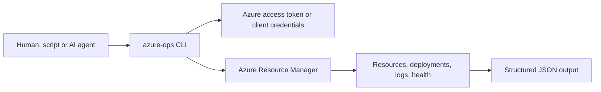

# Azure Ops CLI

Agent-friendly Azure operations evidence for resources, App Service, deployments, activity logs and health.

Inspect. Correlate. Recover.

[](https://github.com/JayRHa/AzureOpsCLI/stargazers)
[](https://github.com/JayRHa/AzureOpsCLI/network/members)
[](https://github.com/JayRHa/AzureOpsCLI/issues)
[](https://github.com/JayRHa/AzureOpsCLI/graphs/contributors)

Azure Resource Manager | Python CLI | JSON-first | Agent Ready

<p>
  <a href="https://jannikreinhard.com/">Blog</a> ·
  <a href="https://www.linkedin.com/in/jannik-r/">LinkedIn</a> ·
  <a href="https://x.com/jannik_reinhard">X</a>
</p>

## What is this?

Azure Ops CLI is a lightweight operations toolkit for collecting Azure Resource Manager evidence in a predictable JSON shape. It is built for terminal troubleshooting, CI checks and AI-agent workflows where the agent needs to inspect what is deployed, when it changed and whether Azure reports health issues.

The CLI focuses on read-heavy operational paths: subscription resources, App Service metadata and config, resource group deployments, Activity Log events and Resource Health. Every command supports `--dry-run` so the exact ARM request can be reviewed before execution.

## How It Works



## Quick Start

```bash
git clone https://github.com/JayRHa/AzureOpsCLI.git
cd AzureOpsCLI
python -m pip install -e .

export AZURE_ACCESS_TOKEN="<access-token>"
azure-ops resources --subscription-id "<subscription-id>" --dry-run
```

Use client credentials instead of a prebuilt token:

```bash
export AZURE_TENANT_ID="<tenant-id>"
export AZURE_CLIENT_ID="<app-registration-client-id>"
export AZURE_CLIENT_SECRET="<client-secret>"

azure-ops appservice show --subscription-id "<subscription-id>" --resource-group "rg-prod" --name "app-prod"
```

## Commands

| Command | Purpose |
| --- | --- |
| `azure-ops resources` | List subscription resources and optionally filter by resource type or name. |
| `azure-ops appservice show` | Read App Service resource metadata. |
| `azure-ops appservice config` | Read App Service web configuration. |
| `azure-ops deployments` | List resource group ARM deployments. |
| `azure-ops activity-log` | Read Azure Activity Log management events for a lookback window. |
| `azure-ops health` | Read Azure Resource Health for one resource ID. |
| `azure-ops request` | Execute a custom ARM request by path and api-version. |

## Examples

```bash
azure-ops resources --subscription-id "<sub>" --resource-type Microsoft.Web/sites
azure-ops deployments --subscription-id "<sub>" --resource-group "rg-prod" --top 10
azure-ops activity-log --subscription-id "<sub>" --resource-group "rg-prod" --since-hours 6
azure-ops health --resource-id "/subscriptions/<sub>/resourceGroups/<rg>/providers/Microsoft.Web/sites/<app>"
```

## Azure Permissions

The CLI uses Azure Resource Manager read operations. A service principal with Reader permissions on the target subscription or resource group is enough for most commands. App Service config reads may require access to the specific App Service resource.

## Output Contract

All commands write JSON to stdout. Errors are written to stderr with a non-zero exit code. This keeps the tool predictable for shell scripts, CI jobs and agent toolchains.

## License

MIT License. See [LICENSE](LICENSE).
